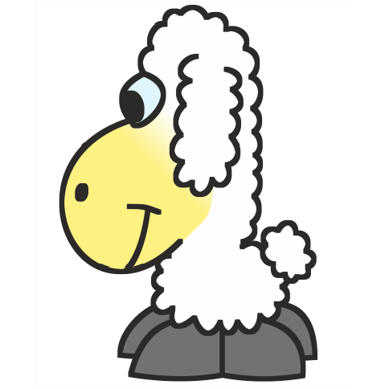

### Hi there I'm "owieczka" which means Little Sheep

- I'm looking to collaborate with other developers
- 2022 Goals: Share more of my work on Github

### Contact with me:

[][website]
[][gitlab]
[][linkedin]
[][slideshare]

 

### Languages and Tools:

#### Native Languages

<!-- Pascal --->
<!-- Visual Basic --->
<!-- QBasic --->

<!-- TeX -->

 

<!--
https://cdn.jsdelivr.net/npm/simple-icons@6.4.0/icons/opengl.svg

-->

#### Mobile

 

#### Web development

 
 

 

#### Version control

 

#### Embeded development

<!--
atmel
microchip
ESP51
--->

 

#### Math tools
<!-- -->

 

#### AI 

 

#### Other

 
 

<!-- 
OpenScad
SolidWorks
-->

<!--
**owieczka/owieczka** is a ✨ _special_ ✨ repository because its `README.md` (this file) appears on your GitHub profile.

Here are some ideas to get you started:

- 🔭 I’m currently working on ...
- 🌱 I’m currently learning ...
- 👯 I’m looking to collaborate on ...
- 🤔 I’m looking for help with ...
- 💬 Ask me about ...
- 📫 How to reach me: ...
- 😄 Pronouns: ...
- ⚡ Fun fact: ...
-->

### License

<!--CC-BY-NC-SA-4.0-->

Shield: [![CC BY-NC-SA 4.0][cc-by-nc-sa-shield]][cc-by-nc-sa]

This work is licensed under a
[Creative Commons Attribution-NonCommercial-ShareAlike 4.0 International License][cc-by-nc-sa].

[![CC BY-NC-SA 4.0][cc-by-nc-sa-image]][cc-by-nc-sa]

[cc-by-nc-sa]: http://creativecommons.org/licenses/by-nc-sa/4.0/
[cc-by-nc-sa-image]: https://licensebuttons.net/l/by-nc-sa/4.0/88x31.png
[cc-by-nc-sa-shield]: https://img.shields.io/badge/License-CC%20BY--NC--SA%204.0-lightgrey.svg

<!--
https://creativecommons.org/licenses/by-nc-sa/4.0/legalcode
-->

[website]: https://www.owieczka.net
[gitlab]: https://gitlab.com/owcakw
[linkedin]: https://www.linkedin.com/in/krzysztof-wegner-a455bb74/
[slideshare]: https://www.slideshare.net/KrzysztofWegner
